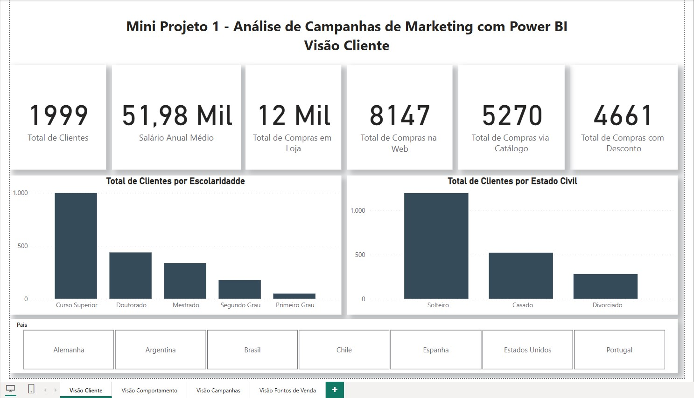
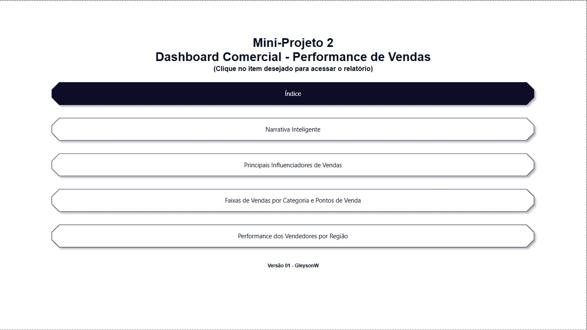
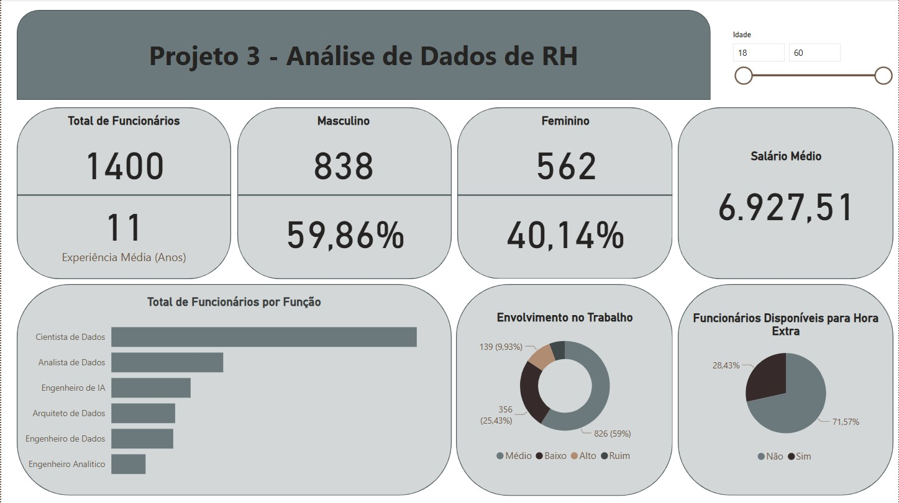
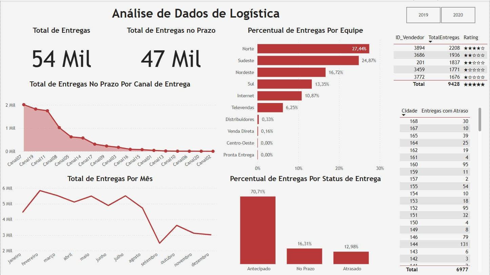

# 📊 Projetos Power BI — Curso DSA

Este repositório reúne os dashboards desenvolvidos por mim ao longo do curso **Microsoft Power BI Para Business Intelligence e Data Science**, oferecido pela Data Science Academy.
Cada projeto é uma aplicação prática de conceitos de BI, modelagem de dados, DAX e visualizações interativas com o Power BI.

---

## 🧠 Conteúdos trabalhados

- Modelagem de dados no Power BI
- Criação de medidas e colunas com DAX
- Visualizações com segmentações, filtros, cartões e gráficos
- Publicação de relatórios no Power BI Online

---

## 📁 Projetos disponíveis

| Projeto      | Descrição                                             | Imagem                                         | Ver Pasta                |
|--------------|-------------------------------------------------------|------------------------------------------------|--------------------------|
| `lab01`      | Dashboard Analítico de Vendas Globais.                |                  | [📂 Acessar](./lab01)    |
| `lab02`      | Dashboard de Vendas, Custo, Margem de Lucro e KPI.    |                  | [📂 Acessar](./lab02)    |
| `projeto01`  | Dashboard Analítico Campanhas de Marketing.           |              | [📂 Acessar](./projeto01)|
| `projeto02`  | Dashboard Comercial - Performance de Vendas.          |              | [📂 Acessar](./projeto02)|
| `projeto03`  | Dashboard Análise de Dados de RH.          |              | [📂 Acessar](./projeto03)|
| `projeto04`  | Correção de Dashboard Logística.          |              | [📂 Acessar](./projeto04)|

---

## 🗂 Estrutura do repositório

Cada pasta contém:

- `README.md`: descrição individual do projeto
- `.pbix`: arquivo editável do Power BI
- `/imagens`: imagens ou miniaturas do dashboard

---

## 💬 Contato

Fique à vontade para abrir uma *issue* ou entrar em contato se quiser trocar ideias, sugestões ou colaborações!

---