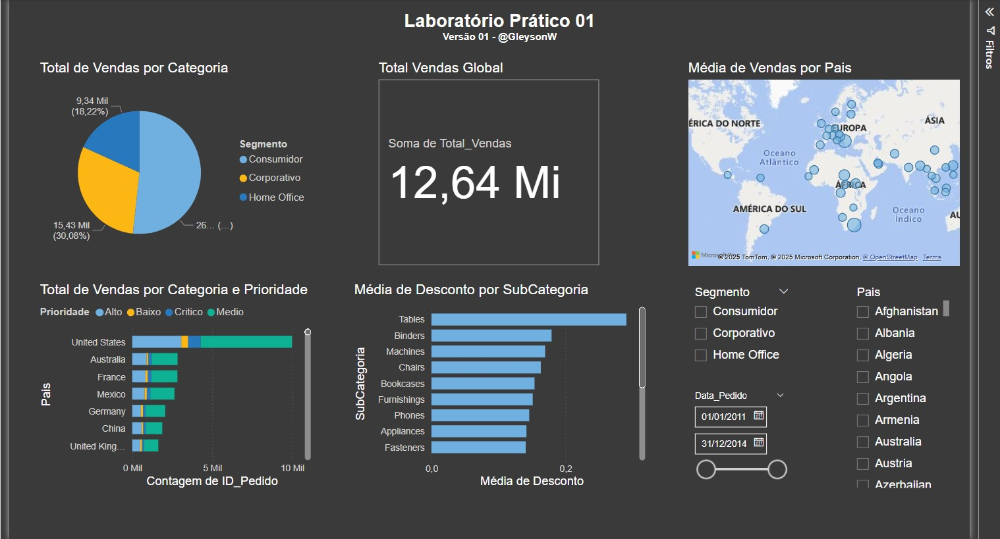

# 📊 Laboratório Prático 01 – Dashboard Analítico de Vendas Globais

## 🧾 Descrição

Este projeto explora visualizações iniciais com Power BI, aplicando conceitos como:

- Gráficos de pizza e barras empilhadas
- Indicadores de valor total
- Mapa de vendas globais
- Filtros interativos por segmento, país e período
- Análises de desconto por subcategoria

## 📌 Objetivo

Praticar a construção de dashboards utilizando recursos básicos e intermediários do Power BI, com foco em:

- Distribuição de vendas por categoria
- Impacto dos descontos nas vendas
- Comportamento de vendas por país e prioridade

## 🖼️ Visual da Dashboard

## 📁 Arquivos

- `dataset.csv`: Base de dados utilizada para construção da análise
- `dash1.jpg`: Imagem da dashboard final
- `lab01.pbix`: Arquivo Power BI

---

🔙 [Voltar ao repositório principal](../README.md)