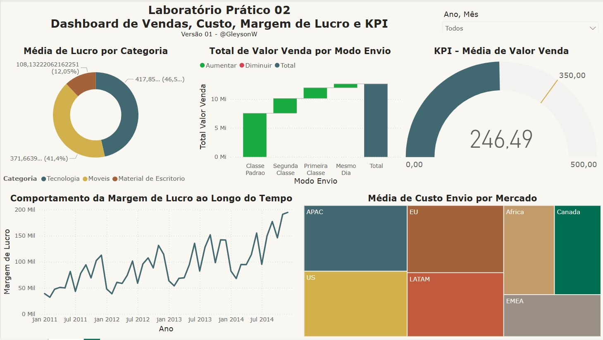

# 📊 Laboratório Prático 02 – Dashboard de Vendas, Custo, Margem de Lucro e KPI

## 🧾 Descrição

Este projeto aprofunda o uso do Power BI com integração de múltiplas fontes de dados e uso de DAX para cálculo de indicadores, aplicando conceitos como:

- Gráficos de rosca, colunas e linhas
- Indicadores de valor médio e margem
- Treemap por tipo de mercado
- Filtros interativos por ano e categoria de produto
- Análises de margem de lucro por categoria e envio

## 📌 Objetivo

Praticar a criação de dashboards com múltiplas tabelas relacionadas, focando em:

- Análise de pedidos por categoria de produto
- Cálculo de valor médio de pedidos e margem
- Distribuição de custos por mercado
- Avaliação de desempenho de tipos de envio

## 🖼️ Visual da Dashboard

## 📁 Arquivos

- `Clientes.csv`: Informações dos clientes (localização, segmento)
- `Pedidos.csv`: Dados de pedidos realizados (valores, datas)
- `Produtos.csv`: Detalhes dos produtos vendidos (categorias, margens)
- `Vendas.csv`: Dados de vendas e envio (valores, quantidades, custo)
- `dash2.jpg`: Imagem da dashboard final
- `lab02.pbix`: Arquivo Power BI

---

🔙 [Voltar ao repositório principal](../README.md)
