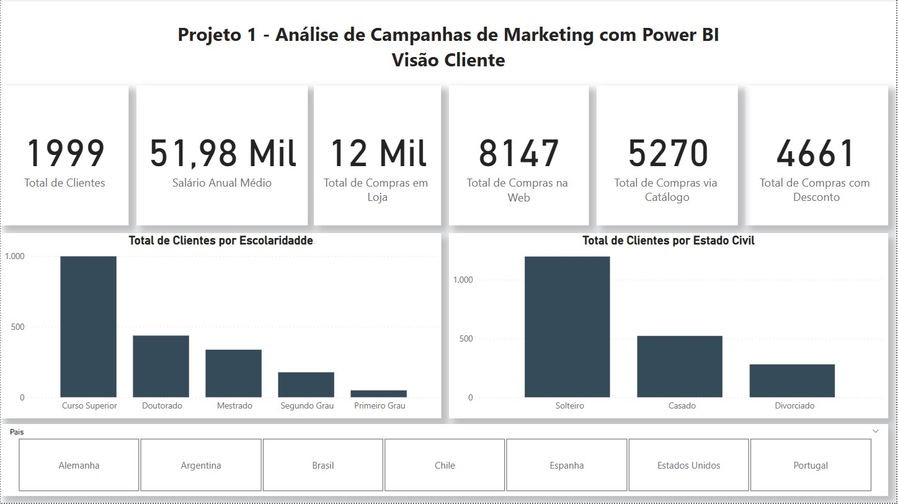
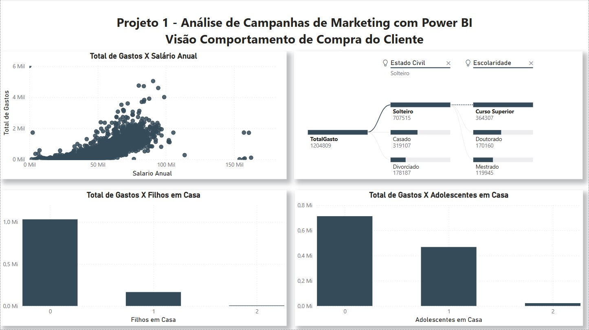
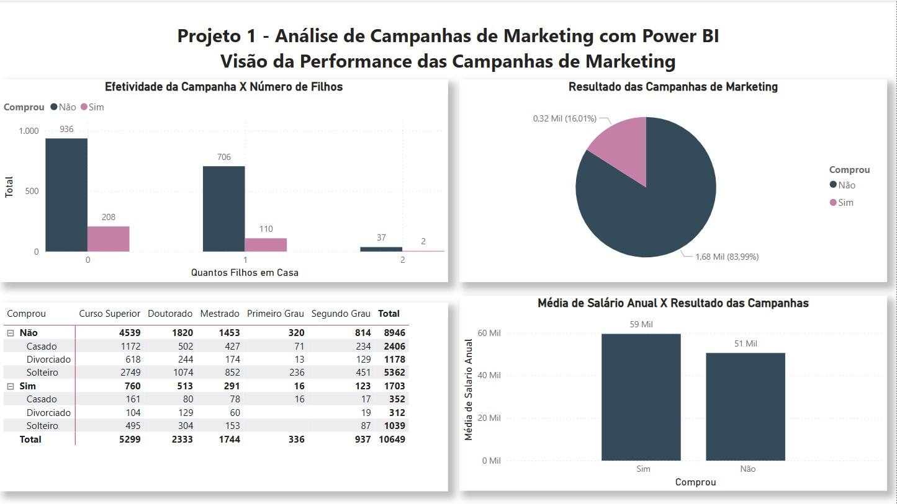
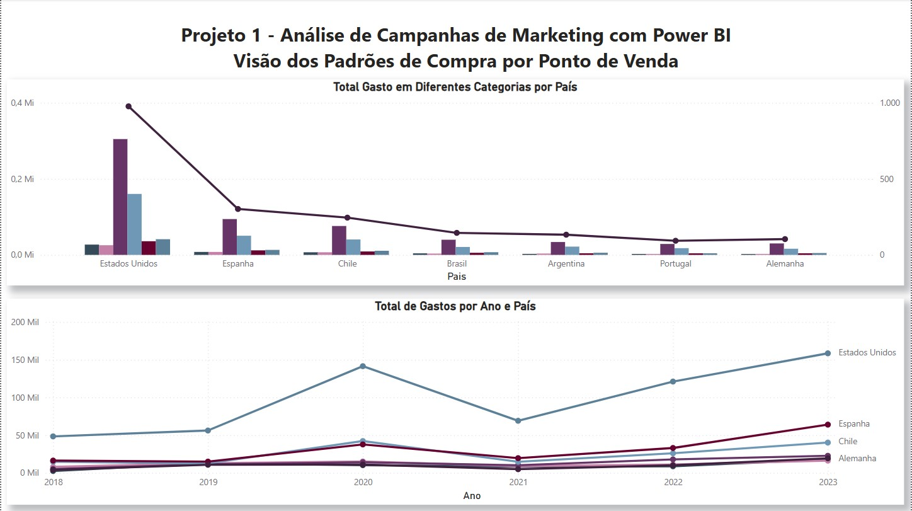

# 📊 Projeto 01 – Dashboard Analítica Campanhas de Marketing

## 🧾 Descrição

Este projeto aprofunda a criação de visualizações com Power BI utilizando uma base de dados de marketing, explorando:

- Análise de canais de marketing e campanhas
- Indicadores de conversão e engajamento
- Gráficos de linha, barras e funil
- Filtros interativos por canal, período e público-alvo
- Segmentação de leads por comportamento

## 📌 Objetivo

Praticar a construção de dashboards utilizando recursos intermediários do Power BI, com foco em:

- Desempenho de campanhas de marketing
- Comportamento do público por canal
- Análise de conversão por etapa do funil

## 🖼️ Visual da Dashboard

  
  

  
  

## 📁 Arquivos

- `dados_marketing.csv`: Base de dados utilizada para construção da análise
- `dash3-1.jpg` a `dash3-4.jpg`: Imagens da dashboard final
- `lab03.pbix`: Arquivo Power BI

---

🔙 [Voltar ao repositório principal](../README.md)