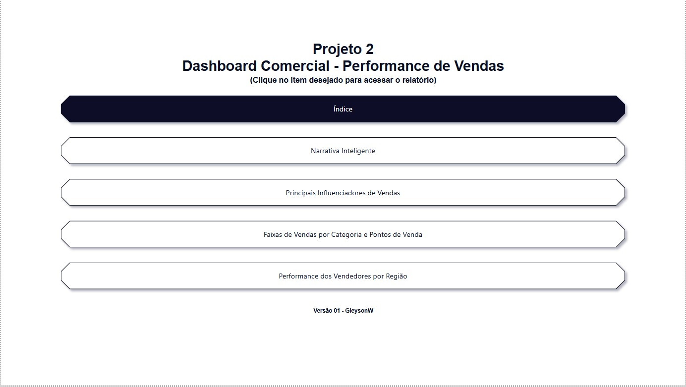
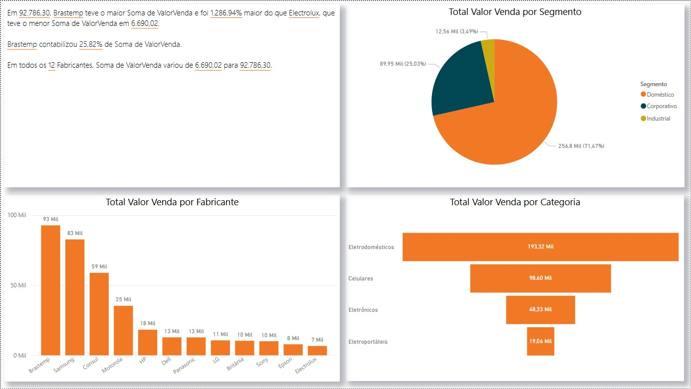
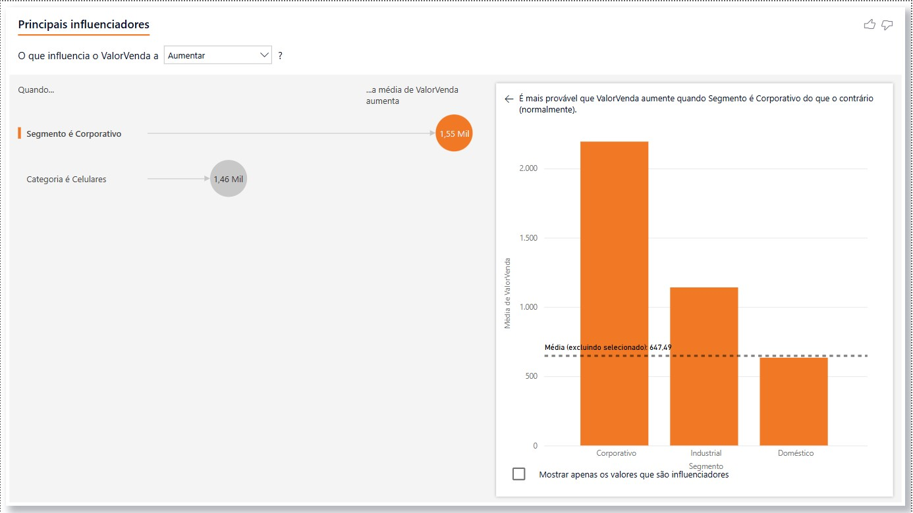
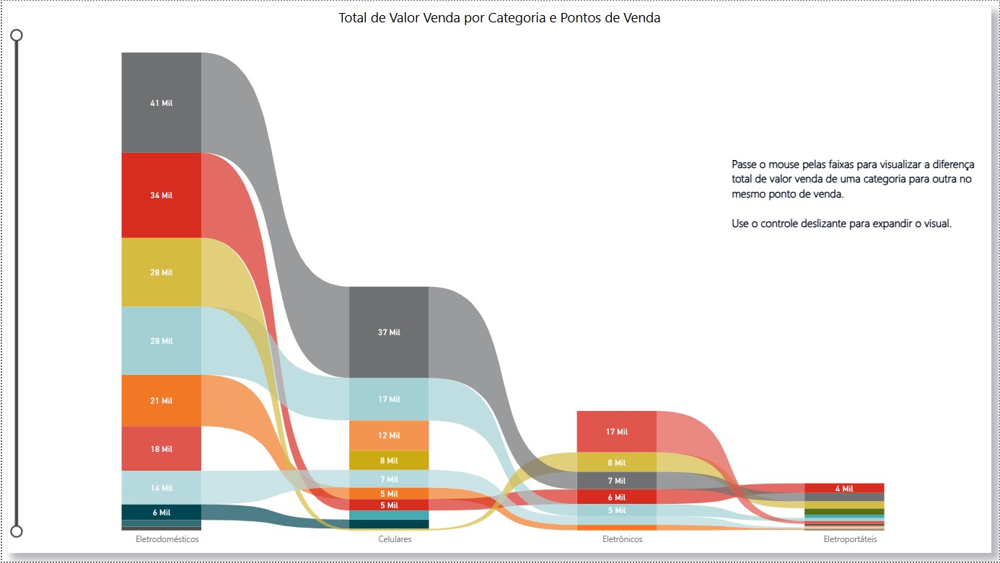
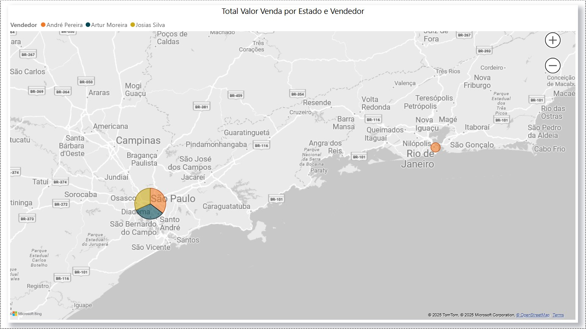

# 📊 Projeto 02 – Dashboard Comercial - Performance de Vendas

## 🧾 Descrição

Este projeto explora visualizações comerciais com Power BI, aplicando conceitos como:

- Indicadores de desempenho por filial
- Gráficos de colunas agrupadas e linhas
- Segmentações por período e filial
- Análise de metas versus realizado
- Visualização de desempenho acumulado

## 📌 Objetivo

Praticar a construção de dashboards utilizando recursos gráficos e analíticos do Power BI, com foco em:

- Comparação entre metas e resultados
- Acompanhamento da performance por filial
- Identificação de tendências ao longo dos meses

## 🖼️ Visual da Dashboard

  
  

  
  

  

## 📁 Arquivos

- `Dados_Comerciais.xlsx`: Base de dados utilizada para construção das análises
- `dash4-1.jpg` a `dash4-5.jpg`: Imagens das páginas da dashboard final
- `projeto02.pbix`: Arquivo Power BI com a construção completa

---

🔙 [Voltar ao repositório principal](../README.md)