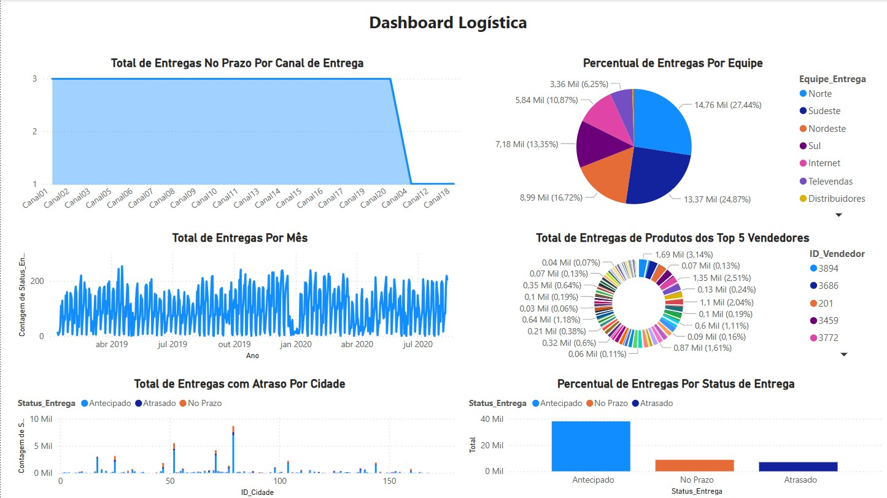

## 📊 Projeto 4 – Correção de Dashboard Logística

## 🧾 Descrição

Este projeto teve como objetivo identificar e corrigir problemas em uma dashboard logística previamente criada de forma inadequada. A visualização original apresentava diversos erros de leitura, má organização visual e falhas técnicas, dificultando a análise eficiente dos dados. A partir disso, foi realizada uma reestruturação completa da dashboard com foco em clareza, precisão e insights relevantes para tomada de decisão.

## ❌ Problemas Identificados na Dashboard Original
A dashboard inicial, conforme mostrado abaixo, apresentava os seguintes problemas:

- Gráficos mal configurados e visualmente poluídos.

- Escalas inconsistentes e ilegíveis.

- Falta de ordenação e categorização adequada dos dados.

- Cores excessivamente saturadas, dificultando a leitura.

- Falta de filtros funcionais e de interatividade.

- Indicadores principais não destacados ou mal apresentados.

## ✅ Solução Aplicada
Após uma análise completa da dashboard e do dataset, foram realizados os seguintes ajustes:

- Reorganização completa do layout.

- Criação de indicadores claros de Total de Entregas e Entregas no Prazo.

- Substituição dos gráficos por representações mais adequadas (ex: barras e linhas em vez de pizza e dispersões).

- Correções nos filtros por período (anos) e por vendedor.

- Reclassificação das entregas por status e por região, com percentuais precisos.

- Aplicação de design visual limpo, com destaque aos dados mais relevantes.

- Inclusão de métricas por canal, cidade e mês, permitindo maior granularidade da análise.

Abaixo, a versão corrigida:

## 🖼️ Visual da Dashboard

### ❌ Antes (com erros)

### ✅ Depois (corrigida)

## 📁 Arquivos

- `dataset.xlsx`: Base de dados com registros logísticos  
- `dash6.jpg`: Imagem da dashboard final corrigida  
- `dash6-errada.jpg`: Imagem da dashboard original com erros  
- `projeto04.pbix`: Arquivo Power BI

---

🔙 [Voltar ao repositório principal](../README.md)