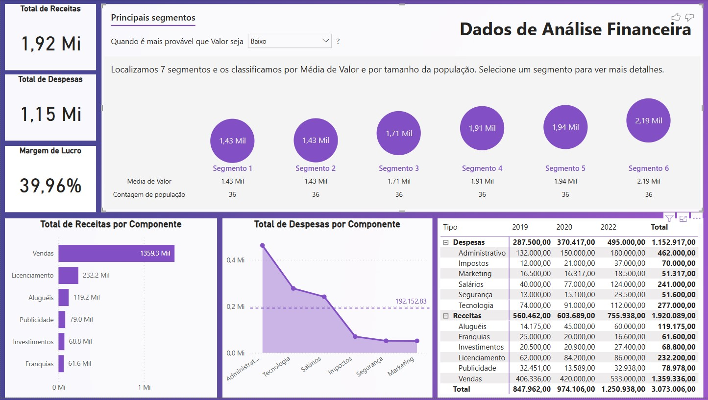

## 📊 Projeto 5 – Análise de Dados Financeiros

## 🧾 Descrição

Este projeto apresenta uma análise financeira com foco na performance de receitas e despesas ao longo do tempo, incluindo:

- Total de receitas e despesas  
- Margem de lucro  
- Receitas e despesas por componente  
- Classificação por segmentos com base em valor médio  
- Evolução temporal por tipo e categoria

## 📌 Objetivo

Desenvolver habilidades de visualização e análise financeira utilizando Power BI, com foco em:

- Identificação de principais fontes de receita e custo  
- Avaliação da lucratividade da empresa  
- Classificação de segmentos com base em desempenho

## 🖼️ Visual da Dashboard

## 📁 Arquivos

- DadosFinanceiros.xlsx: Base de dados utilizada para construção da análise  
- dash7.jpg: Imagem da dashboard final  
- projeto05.pbix: Arquivo Power BI

---

🔙 [Voltar ao repositório principal](../README.md)