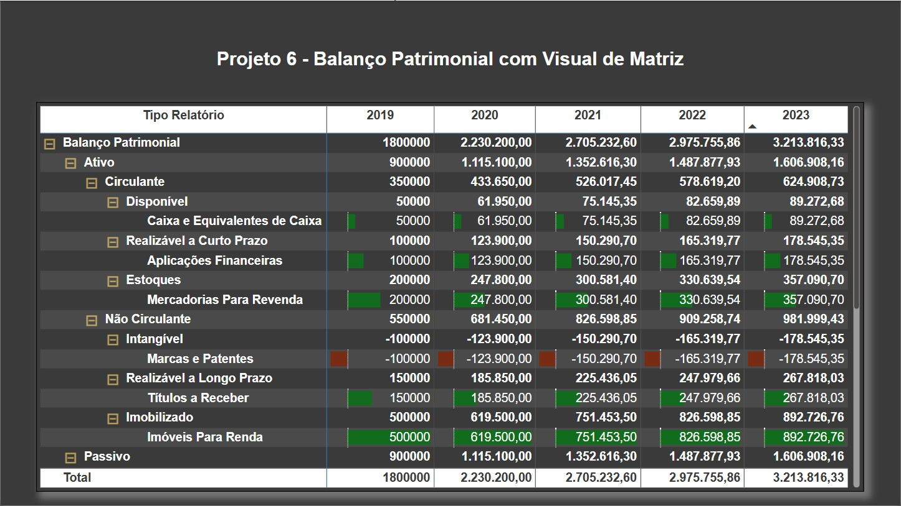

## 📊 Projeto 6 – Balanço Patrimonial com Visual de Matriz

## 🧾 Descrição

Neste projeto, foram aplicados recursos do Power BI para representar os dados financeiros de forma clara e segmentada, com uso de:

- Visual de matriz com hierarquia expandida
- Indicadores financeiros por ano (2019 a 2023)
- Diferenciação entre ativo circulante, não circulante e passivo
- Destaques com formatação condicional para variações positivas e negativas

## 📌 Objetivo

Exercitar a organização e visualização de grandes volumes de dados financeiros com foco em:

- Análise de evolução patrimonial
- Comparação anual de ativos e passivos
- Interpretação visual da performance contábil

## 🖼️ Visual da Dashboard

## 📁 Arquivos

- dataset.xlsx: Base de dados utilizada para construção da análise  
- dash8.jpg: Imagem da dashboard final  
- projeto06.pbix: Arquivo Power BI

---

🔙 [Voltar ao repositório principal](../README.md)
