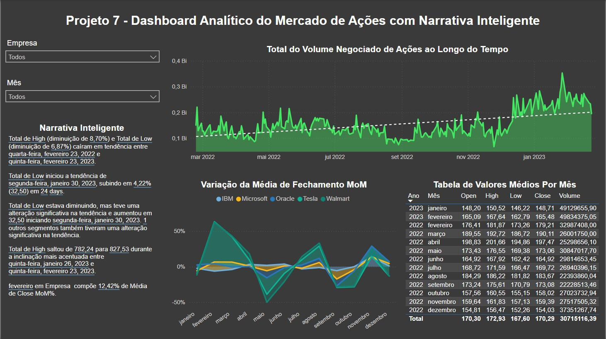

## 📊 Projeto 7 – Dashboard Analítico do Mercado de Ações com Narrativa Inteligente

## 🧾 Descrição 

Este projeto tem como foco analisar o comportamento do mercado de ações por meio de visualizações interativas e narrativas automatizadas, incluindo:

- Volume negociado de ações ao longo do tempo
- Variação da média de fechamento mês a mês
- Insights automáticos sobre tendências de alta e baixa
- Tabela detalhada com valores médios por mês

## 📌 Objetivo

Demonstrar a aplicação de storytelling com dados dentro do Power BI, gerando insights inteligentes e facilitando a tomada de decisão com base em:

- Tendências de volume negociado
- Comportamento de empresas específicas
- Geração automática de análises em linguagem natural

## 🖼️ Visual da Dashboard

## 📁 Arquivos

- StockMarket.xlsx: Base de dados utilizada para construção da análise  
- dash9.jpg: Imagem da dashboard final  
- projeto07.pbix: Arquivo Power BI

---

🔙 [Voltar ao repositório principal](../README.md)